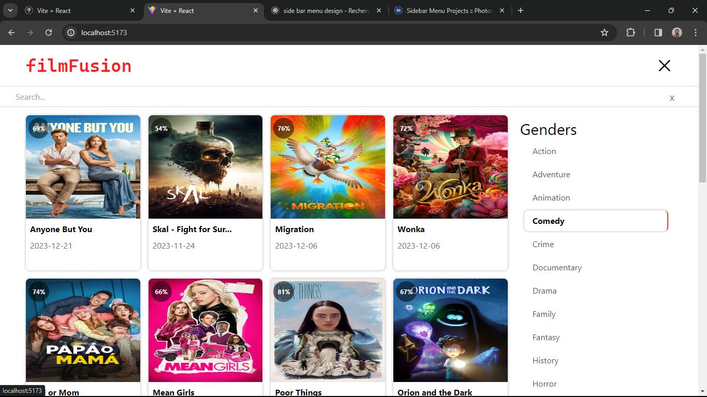

# FilmFusion
##  This project is a single page application built with react and redux .
#### The application is a filmFusion it uses TMDB Api to get the data and has two main pages.

> The home page is a list of films and tv show from which you can select a specific to see the details of the film.

> The details page it basically provide the details about a specific film.

## Built With

- javaScript
- React
- TMDB
- Redux
- Node js
- Heroku

## Live Demo

[Live Demo Link](https://recipes-catalogue.netlify.app/)

## Getting Started

Here are the steps to follow in order to get this project on your local computer.

### Prerequisites

`node v18.15.0 +`

`npm v9.5.0 +`

### Setup

clone this repo by typing `git clone`

### Install

install the dependacies by typing `npm install`

### Usage

start the local server by running `npm start`

### Deployment

this project is deployed on heroku

to get the deployment build of the code run `npm run build`

### Testing

this project uses vitest from testing , to run the tests type `npm test` 

## Authors

👤 **Jospin Ndaano**

- Github: [@Jospin6](https://github.com/Jospin6)
- Linkedin: [@Jospin](https://www.linkedin.com/in/jospin-ndagano-8474b7267/)

## 🤝 Contributing

Contributions, issues and feature requests are welcome!

Feel free to check the [issues page](issues/).

## Show your support

Give a ⭐️ if you like this project!

## Acknowledgments

- Hat tip to anyone whose code was used
- Inspiration

## 📝 License

This project is [MIT](lic.url) licensed
